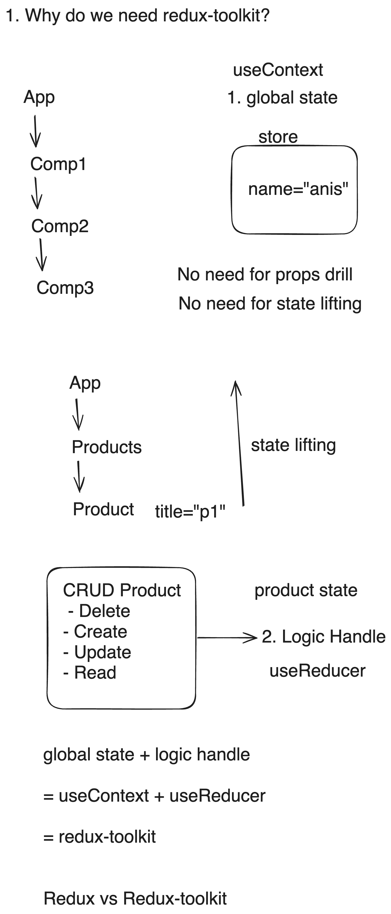

# Redux-ReduxToolkit Tutorial

[video playlist link here](https://youtube.com/playlist?list=PLgH5QX0i9K3pe7Z7ATcyLdUW3grE4Vfld)

## Table of Contents

1. Redux

   [1. Introduction to Redux](#1-introduction-to-redux)

   [2. Redux core concept](#2-redux-core-concept)

   [3. Complete Counter App](#3-complete-counter-app)

   [4. Payload in action](#4-payload-in-action)

   [5. Multiple reducers & combine multiple reducers](#5-multiple-reducers--combine-multiple-reducers)

   [6. Middleware](#6-middleware)

   [7. API Calling - async actions using redux-thunk](#7-api-calling---async-actions-using-redux-thunk)

   [8. React-redux counter example](#8-react-redux-counter-example)

   [9. API calling in react-redux](#9-api-calling-in-react-redux)

2. Redux-toolkit

   [10. Redux-Toolkit Counter App](#10-redux-toolkit-counter-app)

   [11. CRUD Book APP using redux-toolkit](#11-crud-book-app-using-redux-toolkit)

   [12. API calling using AsyncThunk](#12-api-calling-using-asyncthunk)

   [13. RTK: CRUD Ecommerce APP](#13-rtk-query--a-complete-crud-app)

3. Redux-toolkit + Typescript

    [14. Redux-toolkit + Typescript CRUD APP](#14-redux-toolkit--typescript-crud-app)

    [15. Redux-toolkit + createAsyncThunk() + Typescript CRUD APP](#15-redux-toolkit--createasyncthunk--typescript-crud-app)

    [16. Redux-toolkit + RTK Query + Typescript CRUD APP](#16-redux-toolkit--rtk-query--typescript-crud-app)

## 1. Introduction to Redux

### 1.1 What is Redux & why Redux?

- A small JS Library
- for managing medium/large amount of states globally
  in your app.
- useContext + useReducer Hook ideas will help you to understand redux.



### 1.2 Some common terms related to redux

- React-redux: redux is used with some common packages such as react-redux
- redux-toolkit : recommended way to write redux logic for building redux app easily and avoiding mistakes.
- redux devtools extension: helps to debug redux app easily.

### 1.3 how redux works?

- define state.
- dispatch an Action.
- Reducer update state based on Action Type.
- store will update the view


## 2. Redux core concept

- State: consider what states you want to manage

  ```js
  // define states
  count: 0;
  const initialState = { count: 0 };
  const initialState2 = { users: [{ name: "anisul islam" }] };
  ```

- Action: actions are object that have 2 things- type & payload

  ```js
  // define constants
  const INCREMENT = "INCREMENT";
  const DECREMENT = "DECREMENT";
  const ADD_USER = "ADD_USER";

  // dispatch(Action)
  {
    type: INCREMENT,
  }
  {
    type: DECREMENT,
  }
  {
    type: ADD_USER,
    payload: {
      name: "rafiqul islam",
    }
  }
  ```

- Reducer: reducers are pure function which handles all logic. it updates the state depends on action type

  ```js
  // crate reducer
  const counterReducer = (state = initialState, action) => {
    switch (action.type) {
      case INCREMENT:
        return {
          ...state,
          count: state.count + 1,
        };
      case DECREMENT:
        return {
          ...state,
          count: state.count - 1,
        };

      default:
        return state;
    }
  };
  ```

- Store: It holds the states. It has 3 important methods- getState(), dispatch(), suscribe()

  ```js
  // 4. store - getState(), dispatch(), subscribe()

  // create store
  const store = createStore(counterReducer);

  store.subscribe(() => {
    console.log(store.getState());
  });

  // dispatch action
  store.dispatch(incrementCounter());
  store.dispatch(incrementCounter());
  store.dispatch(incrementCounter());
  store.dispatch(decrementCounter());
  ```

## 3. Complete Counter App

- example of counter app

  ```js
  const { createStore } = require("redux");

  const INCREMENT = "INCREMENT";
  const DECREMENT = "DECREMENT";
  const RESET = "RESET";

  const initialCounterState = {
    count: 0,
  };

  const incrementCounter = () => {
    return {
      type: INCREMENT,
    };
  };
  const decrementCounter = () => {
    return {
      type: DECREMENT,
    };
  };
  const resetCounter = () => {
    return {
      type: RESET,
    };
  };

  const counterReducer = (state = initialCounterState, action) => {
    switch (action.type) {
      case INCREMENT:
        return {
          ...state,
          count: state.count + 1,
        };
      case DECREMENT:
        return {
          ...state,
          count: state.count - 1,
        };
      case RESET:
        return {
          ...state,
          count: 0,
        };

      default:
        state;
    }
  };

  const store = createStore(counterReducer);

  store.subscribe(() => {
    console.log(store.getState());
  });

  store.dispatch(incrementCounter());
  store.dispatch(incrementCounter());
  store.dispatch(decrementCounter());
  store.dispatch(resetCounter());
  ```

## 4. Payload in action

- example

  ```js
  const { createStore } = require("redux");

  const GET_PRODUCTS = "GET_PRODUCTS";
  const ADD_PRODUCTS = "ADD_PRODUCTS";

  const initialProductState = {
    products: ["sugar", "salt"],
    numberOfProducts: 2,
  };

  const getProductAction = () => {
    return {
      type: GET_PRODUCTS,
    };
  };
  const addProductAction = (product) => {
    return {
      type: ADD_PRODUCTS,
      payload: product,
    };
  };

  const productsReducer = (state = initialProductState, action) => {
    switch (action.type) {
      case GET_PRODUCTS:
        return {
          ...state,
        };
      case ADD_PRODUCTS:
        return {
          products: [...state.products, action.payload],
          numberOfProducts: state.numberOfProducts + 1,
        };

      default:
        return state;
    }
  };

  const store = createStore(productsReducer);

  store.subscribe(() => {
    console.log(store.getState());
  });

  store.dispatch(getProductAction());
  store.dispatch(addProductAction("pen"));
  store.dispatch(addProductAction("pencil"));
  ```

## 5. Multiple reducers & combine multiple reducers

- example

  ```js
  const { createStore, combineReducers } = require("redux");

  // product constants
  const GET_PRODUCTS = "GET_PRODUCTS";
  const ADD_PRODUCTS = "ADD_PRODUCTS";

  // cart constants
  const GET_CART_ITEMS = "GET_CART_ITEMS";
  const ADD_CART_ITEMS = "ADD_CART_ITEMS";

  // product states
  const initialProductState = {
    products: ["sugar", "salt"],
    numberOfProducts: 2,
  };

  // cart states
  const initialCartState = {
    cart: ["sugar"],
    numberOfProducts: 1,
  };

  // product actions
  const getProductAction = () => {
    return {
      type: GET_PRODUCTS,
    };
  };
  const addProductAction = (product) => {
    return {
      type: ADD_PRODUCTS,
      payload: product,
    };
  };

  // cart actions
  const getCartAction = () => {
    return {
      type: GET_CART_ITEMS,
    };
  };
  const addCartAction = (product) => {
    return {
      type: ADD_CART_ITEMS,
      payload: product,
    };
  };

  const productsReducer = (state = initialProductState, action) => {
    switch (action.type) {
      case GET_PRODUCTS:
        return {
          ...state,
        };
      case ADD_PRODUCTS:
        return {
          products: [...state.products, action.payload],
          numberOfProducts: state.numberOfProducts + 1,
        };

      default:
        return state;
    }
  };

  const cartReducer = (state = initialCartState, action) => {
    switch (action.type) {
      case GET_CART_ITEMS:
        return {
          ...state,
        };
      case ADD_CART_ITEMS:
        return {
          cart: [...state.cart, action.payload],
          numberOfProducts: state.numberOfProducts + 1,
        };

      default:
        return state;
    }
  };

  const rootReduer = combineReducers({
    productR: productsReducer,
    cartR: cartReducer,
  });

  const store = createStore(rootReduer);

  store.subscribe(() => {
    console.log(store.getState());
  });

  store.dispatch(getProductAction());
  store.dispatch(addProductAction("pen"));
  store.dispatch(getCartAction());
  store.dispatch(addCartAction("salt"));
  ```

## 6. Middleware

- for extra features, middlepoint of dispatching an action and handledby reducer, performing async tasks, login etc.
- Example of popular redux middlewares packages: redux-logger, redux-thunk
- `npm install redux-logger`
- example

  ```js
  const { createStore, combineReducers, applyMiddleware } = require("redux");
  const { default: logger } = require("redux-logger");

  // product constants
  const GET_PRODUCTS = "GET_PRODUCTS";
  const ADD_PRODUCTS = "ADD_PRODUCTS";

  // product states
  const initialProductState = {
    products: ["sugar", "salt"],
    numberOfProducts: 2,
  };

  // product actions
  const getProductAction = () => {
    return {
      type: GET_PRODUCTS,
    };
  };
  const addProductAction = (product) => {
    return {
      type: ADD_PRODUCTS,
      payload: product,
    };
  };

  const productsReducer = (state = initialProductState, action) => {
    switch (action.type) {
      case GET_PRODUCTS:
        return {
          ...state,
        };
      case ADD_PRODUCTS:
        return {
          products: [...state.products, action.payload],
          numberOfProducts: state.numberOfProducts + 1,
        };

      default:
        return state;
    }
  };

  const store = createStore(productsReducer, applyMiddleware(logger));

  store.subscribe(() => {
    console.log(store.getState());
  });

  store.dispatch(getProductAction());
  store.dispatch(addProductAction("pen"));
  ```

## 7. API Calling - async actions using redux-thunk

- example

  ```js
  // async actions - api calling
  // api url - https://jsonplaceholder.typicode.com/todos
  // middleware- redux-thunk
  // axios api

  const { default: axios } = require("axios");
  const { createStore, applyMiddleware } = require("redux");
  const reduxThunk = require("redux-thunk").default;

  // define constants
  const GET_TODOS_REQUEST = "GET_TODOS_REQUEST";
  const GET_TODOS_SUCCESS = "GET_TODOS_SUCCESS";
  const GET_TODOS_FAILED = "GET_TODOS_FAILED";
  const TODOS_URL = "https://jsonplaceholder.typicode.com/todos";

  // define state
  const initialTodosState = {
    todos: [],
    isLoading: false,
    error: null,
  };

  const getTodosRequest = () => {
    return {
      type: GET_TODOS_REQUEST,
    };
  };

  const getTodosSuccess = (todos) => {
    return {
      type: GET_TODOS_SUCCESS,
      payload: todos,
    };
  };
  const getTodosFailed = (error) => {
    return {
      type: GET_TODOS_FAILED,
      payload: error,
    };
  };

  const todosReducer = (state = initialTodosState, action) => {
    switch (action.type) {
      case GET_TODOS_REQUEST:
        return {
          ...state,
          isLoading: true,
        };
      case GET_TODOS_SUCCESS:
        return {
          ...state,
          todos: action.payload,
          isLoading: false,
        };
      case GET_TODOS_FAILED:
        return {
          ...state,
          isLoading: false,
          error: action.payload,
        };

      default:
        state;
    }
  };

  // async action creator
  // thunk-middleware allows us to return a function isntead of obejct
  const fetchData = () => {
    return (dispatch) => {
      dispatch(getTodosRequest());
      axios
        .get(TODOS_URL)
        .then((res) => {
          const todos = res.data;
          const titles = todos.map((todo) => todo.title);
          dispatch(getTodosSuccess(titles));
        })
        .catch((err) => {
          const error = err.message;
          dispatch(getTodosFailed(error));
        });
    };
  };

  const store = createStore(todosReducer, applyMiddleware(reduxThunk));

  store.subscribe(() => {
    console.log(store.getState());
  });

  store.dispatch(fetchData());
  ```

## 8. React-redux counter example

- install redux and react-redux package
- we will make a counter app; first we will build with state and then we will do this with react-redux. example

  ```js
  // App.js
  import React, { useState } from "react";

  // state - count:0
  // action - increment, decrement, reset
  /*
      reducer - handle logic for state update
      count => count + 1
      count => count - 1
      count => 0
      */

  const App = () => {
    const [count, setCount] = useState(0);

    const handleIncrement = () => {
      setCount((count) => count + 1);
    };

    const handleReset = () => {
      setCount(0);
    };

    const handleDecrement = () => {
      setCount((count) => count - 1);
    };

    return (
      <div>
        <h1>React Redux Example</h1>
        <h2>Count : {count}</h2>
        <button onClick={handleIncrement}>Increment</button>
        <button onClick={handleReset}>Reset</button>
        <button onClick={handleDecrement}>Decrement</button>
      </div>
    );
  };

  export default App;
  ```

- now we will make the same counter app using react-redux

```js
  // step 1: create constants
  //services/constants/counterConstants.js
    export const INCREMENT = "INCREMENT";
    export const RESET = "RESET";
    export const DECREMENT = "DECREMENT";

  // step 2: create actions
  //services/actions/counterActions.js
  // action - increment, decrement, reset

    import { DECREMENT, INCREMENT, RESET } from "../constants/counterConstants";

    export const incrementCounter = () => {
      return {
        type: INCREMENT,
      };
    };

    export const resetCounter = () => {
      return {
        type: RESET,
      };
    };

    export const decrementCounter = () => {
      return {
        type: DECREMENT,
      };
    };


    // step 3: create reducers
    //services/reducers/counterReducer.js
        /*
      reducer - handle logic for state update
        count => count + 1
        count => count - 1
        count => 0
      */
      import { DECREMENT, INCREMENT, RESET } from "../constants/counterConstants";

      const initialState = { count: 0 };

      const counterReducer = (state = initialState, action) => {
        switch (action.type) {
          case INCREMENT:
            return {
              ...state,
              count: state.count + 1,
            };
          case RESET:
            return {
              ...state,
              count: 0,
            };
          case DECREMENT:
            return {
              ...state,
              count: state.count - 1,
            };

          default:
            return state;
        }
      };

      export default counterReducer;

    // step 4: create store
    // npm install redux
    // src/store.js
        import { createStore } from "redux";
        import counterReducer from "./services/reducers/counterReducer";
        const store = createStore(counterReducer);
        export default store;

      // step 5: provide store in index.js
      // npm install react-redux
        import React from "react";
        import { createRoot } from "react-dom/client";
        import { Provider } from "react-redux";

        import App from "./App";
        import store from "./store";

        const container = document.getElementById("root");
        const root = createRoot(container);

        root.render(
          <Provider store={store}>
            <App />
          </Provider>
        );

      // step 6: use store in anywhere in your app. for example in Counter.js
      import React from "react";
      import { useDispatch, useSelector } from "react-redux";
      import {
        incrementCounter,
        decrementCounter,
        resetCounter,
      } from "./services/actions/counterAction";

      const Counter = () => {
        const count = useSelector((state) => state.count);
        const dispatch = useDispatch();

        const handleIncrement = () => {
          dispatch(incrementCounter());
        };

        const handleReset = () => {
          dispatch(resetCounter());
        };

        const handleDecrement = () => {
          dispatch(decrementCounter());
        };

        return (
          <div>
            <h1>React Redux Example</h1>
            <h2>Count : {count}</h2>
            <button onClick={handleIncrement}>Increment</button>
            <button onClick={handleReset}>Reset</button>
            <button onClick={handleDecrement}>Decrement</button>
          </div>
        );
      };

      export default Counter;

      // create actions & constants
      // create reducers
      // create & provide store
      // useSelector, useDispatch

```

## 9. API calling in react-redux

- step 1: setup project & install packages `npm install redux react-redux redux-thunk axios`
- step 2: define constants-> src/services/constants/todosConstant.js

```js
export const GET_TODOS_REQUEST = "GET_TODOS_REQUEST";
export const GET_TODOS_SUCCESS = "GET_TODOS_SUCCESS";
export const GET_TODOS_FAILED = "GET_TODOS_FAILED";
```

- step 3: create async action creator -> src/services/actions/todosAction.js

  ```js
  import {
    GET_TODOS_FAILED,
    GET_TODOS_REQUEST,
    GET_TODOS_SUCCESS,
  } from "../constants/todosConstant";

  import axios from "axios";

  export const getAllTodos = () => async (dispatch) => {
    dispatch({ type: GET_TODOS_REQUEST });
    try {
      const res = await axios.get("https://jsonplaceholder.typicode.com/posts");
      dispatch({ type: GET_TODOS_SUCCESS, payload: res.data });
    } catch (error) {
      dispatch({ type: GET_TODOS_FAILED, payload: error.message });
    }
  };
  ```

- step 4: create reducer -> src/services/reducers/todosReducer.js

  ```js
  import {
    GET_TODOS_FAILED,
    GET_TODOS_REQUEST,
    GET_TODOS_SUCCESS,
  } from "../constants/todosConstant";

  const initialState = {
    isLoading: false,
    todos: [],
    error: null,
  };

  export const todosReducer = (state = initialState, action) => {
    switch (action.type) {
      case GET_TODOS_REQUEST:
        return {
          ...state,
          isLoading: true,
        };
      case GET_TODOS_SUCCESS:
        return {
          isLoading: false,
          todos: action.payload,
          error: null,
        };
      case GET_TODOS_FAILED:
        return {
          isLoading: false,
          todos: [],
          error: action.payload,
        };

      default:
        return state;
    }
  };
  ```

- step 5: create store -> src/store.js

  ```js
  import { applyMiddleware, createStore } from "redux";
  import thunk from "redux-thunk";
  import { todosReducer } from "./services/reducers/todosReducer";

  const store = createStore(todosReducer, applyMiddleware(thunk));
  export default store;
  ```

- step 6: provide store -> src/index.js

  ```js
  import React from "react";
  import ReactDOM from "react-dom/client";
  import "./index.css";
  import App from "./App";
  import reportWebVitals from "./reportWebVitals";

  import { Provider } from "react-redux";
  import store from "./store";

  const root = ReactDOM.createRoot(document.getElementById("root"));

  root.render(
    <Provider store={store}>
      <App />
    </Provider>
  );
  reportWebVitals();
  ```

- step 7: use store -> src/components/Todos.js

  ```js
  import React, { useEffect } from "react";
  import { useDispatch, useSelector } from "react-redux";
  import { getAllTodos } from "../services/actions/todosAction";

  const Todos = () => {
    const { isLoading, todos, error } = useSelector((state) => state);

    console.log(isLoading);

    const dispatch = useDispatch();
    useEffect(() => {
      dispatch(getAllTodos());
    }, []);

    return (
      <div>
        <h2>Todos App</h2>
        {isLoading && <h3>Loading ...</h3>}
        {error && <h3>{error.message}</h3>}
        <section>
          {todos &&
            todos.map((todo) => {
              return (
                <article key={todo.id}>
                  <h4>{todo.id}</h4>
                  <p>{todo.title}</p>
                </article>
              );
            })}
        </section>
      </div>
    );
  };
  export default Todos;
  ```

- step 8: adding style -> src/App.css

  ```css
  section {
    display: grid;
    grid-gap: 0.5rem;
    padding: 1rem;
  }

  article {
    background-color: #293462;
    color: white;
    padding: 0.5rem;
  }

  @media (min-width: 600px) {
    section {
      grid-template-columns: auto auto;
    }
  }
  @media (min-width: 768px) {
    section {
      grid-template-columns: auto auto auto;
    }
  }
  ```

## 10. redux-toolkit counter app

- step1: install packages -> `npm install @reduxjs/toolkit react-redux`
- step2: create a recommended folder structure for redux-toolkit - features (contains individual feature of our app) - app (contains store of our app)
- step3: create slice. collection of logic for a feature is called slices in redux. - src/features/counter/counterSlice

  ```js
  import { createSlice } from "@reduxjs/toolkit";

  // state: count:0
  // increment, decrement, reset

  // const incrementCounter = () => {
  //   return { type: "INCREMENT" };
  // };

  export const counterSlice = createSlice({
    name: "counter",
    initialState: { count: 0 },
    reducers: {
      increment: (state) => {
        state.count = state.count + 1;
      },
      decrement: (state) => {
        state.count = state.count - 1;
      },
      reset: (state) => {
        state.count = 0;
      },
      increaseByAmount: (state, action) => {
        state.count = state.count + action.payload;
      },
    },
  });

  // export reducer and action createor
  // Action creators are generated for each case reducer function
  export const { increment, decrement, reset, increaseByAmount } =
    counterSlice.actions;

  export default counterSlice.reducer;
  ```

- step4: create store -> app/store.js

  ```js
  import { configureStore } from "@reduxjs/toolkit";

  import counterReducer from "../features/counter/counterSlice";

  const store = configureStore({
    reducer: {
      counter: counterReducer,
    },
  });
  export default store;
  ```

- step5: provide store in root file -> src/index.js

  ```js
  import React from "react";
  import ReactDOM from "react-dom/client";
  import "./index.css";
  import App from "./App";
  import reportWebVitals from "./reportWebVitals";
  import { Provider } from "react-redux";

  import store from "./app/store";

  const root = ReactDOM.createRoot(document.getElementById("root"));
  root.render(
    <Provider store={store}>
      <App />
    </Provider>
  );
  ```

- step6: use store & dispatch actions

  ```js
  import React from "react";
  import { useDispatch, useSelector } from "react-redux";
  import {
    decrement,
    increaseByAmount,
    increment,
    reset,
  } from "./counterSlice";

  const CounterView = () => {
    const count = useSelector((state) => state.counter.count);

    const dispatch = useDispatch();

    return (
      <div>
        <h2>Counter: {count}</h2>
        <button
          onClick={() => {
            dispatch(increment());
          }}
        >
          Increment
        </button>
        <button
          onClick={() => {
            dispatch(reset());
          }}
        >
          reset
        </button>
        <button
          onClick={() => {
            dispatch(decrement());
          }}
        >
          Decrement
        </button>
        <button
          onClick={() => {
            dispatch(increaseByAmount(5));
          }}
        >
          IncrementBy5
        </button>
      </div>
    );
  };

  export default CounterView;
  ```

## 11. [CRUD Book APP using redux-toolkit](https://reduxtoolkitbookcrudapp.netlify.app/)

- [project code in github](https://github.com/anisul-Islam/redux-toolkit-book-crud-app)
- [project demo website: CRUD Book App](https://reduxtoolkitbookcrudapp.netlify.app/)

## 12. API calling using AsyncThunk

- [project github repo link](https://github.com/anisul-Islam/redux-toolkit-ecommerce-asyncthunk)

### Step 1: Setup the Project

1. **Initialize the project:**

```bash
npx create-react-app redux-crud-app
cd redux-crud-app
npm install @reduxjs/toolkit react-redux axios
```

### Step 2: Setup Redux Toolkit

1. **Create the Redux store:**

```javascript
// src/app/store.js
import { configureStore } from '@reduxjs/toolkit';
import productsReducer from '../features/products/productsSlice';

export const store = configureStore({
  reducer: {
    products: productsReducer,
  },
});
```

2. **Setup the Redux provider in your `index.js`:**

```javascript
// src/index.js
import React from 'react';
import ReactDOM from 'react-dom';
import './index.css';
import App from './App';
import { Provider } from 'react-redux';
import { store } from './app/store';

ReactDOM.render(
  <Provider store={store}>
    <App />
  </Provider>,
  document.getElementById('root')
);
```

### Step 3: Create the Product Slice

1. **Create a product slice using Redux Toolkit and `createAsyncThunk`:**

```javascript
// src/features/products/productsSlice.js
// @ts-nocheck
import { createAsyncThunk, createSlice } from '@reduxjs/toolkit';
import axios from 'axios';

const initialState = {
  products: [],
  isloading: false,
  error: null,
};

const BASE_URL = 'http://localhost:3003/products';

export const fetchProducts = createAsyncThunk(
  'products/fetchProducts',
  async () => {
    const res = await axios.get(BASE_URL);
    return res.data;
  }
);

export const deleteProduct = createAsyncThunk(
  'products/deleteProduct',
  async (id) => {
    const res = await axios.delete(`${BASE_URL}/${id}`);
    return id;
  }
);

export const createProduct = createAsyncThunk(
  'products/createProduct',
  async (product) => {
    const res = await axios.post(BASE_URL, product);
    return res.data;
  }
);

export const updateProduct = createAsyncThunk(
  'products/updateProduct',
  async ({ id, product }) => {
    const res = await axios.put(`${BASE_URL}/${id}`, product);
    return res.data;
  }
);

// pending, fulfilled, rejected

export const productSlice = createSlice({
  name: 'products',
  initialState,
  reducers: {},
  extraReducers: (builder) => {
    builder
      .addCase(fetchProducts.pending, (state) => {
        state.isloading = true;
        state.error = null;
      })
      .addCase(fetchProducts.fulfilled, (state, action) => {
        state.isloading = false;
        state.products = action.payload;
      })
      .addCase(fetchProducts.rejected, (state, action) => {
        state.isloading = false;
        state.error = 'Failed to fetch data' || action.error.message;
      })
      .addCase(deleteProduct.fulfilled, (state, action) => {
        state.products = state.products.filter(
          (product) => product.id !== action.payload
        );
      })
      .addCase(createProduct.fulfilled, (state, action) => {
        state.products.push(action.payload);
      })
      .addCase(updateProduct.fulfilled, (state, action) => {
        const index = state.products.findIndex(
          (product) => product.id === action.payload.id
        );
        state.products[index] = action.payload;
      });
  },
});

export default productSlice.reducer;

```

### Step 4: Create Components

1. **Create a component to list products:**

```javascript
// src/features/products/ProductsList.js
//@ts-nocheck
import React, { useEffect } from 'react';
import { useDispatch, useSelector } from 'react-redux';

import { deleteProduct, fetchProducts, updateProduct } from './productSlice';

const ProductListView = ({ onHandleSetProductToEdit }) => {
  const { products, isLoading, error } = useSelector(
    (state) => state.productsR
  );

  const dispatch = useDispatch();

  useEffect(() => {
    dispatch(fetchProducts());
  }, [dispatch]);

  const handleEdit = (product) => {
    onHandleSetProductToEdit(product);
  };

  return (
    <div>
      {isLoading && <p>Loading...</p>}
      {error && <p>{error}</p>}
      {!isLoading && !error && products && products.length > 0 && (
        <section className="products">
          {products.map((product) => {
            return (
              <article key={product.id} className="product">
                <h3>{product.title}</h3>
                <p>{product.description}</p>
                <p>Category: {product.category}</p>
                <p>Price: {product.price}</p>
                <button onClick={() => dispatch(deleteProduct(product.id))}>
                  Delete
                </button>
                <button onClick={() => handleEdit(product)}>Edit</button>
              </article>
            );
          })}
        </section>
      )}
    </div>
  );
};

export default ProductListView;
```

2. **Create a component to add and update products:**

```javascript
// src/features/products/ProductForm.js
//@ts-nocheck
import React, { useEffect, useState } from 'react';
import { nanoid } from 'nanoid';
import { useDispatch } from 'react-redux';
import { createProduct, updateProduct } from './productSlice';

const ProductForm = ({ productToEdit = {}, isEdit = false, resetForm }) => {
  const dispatch = useDispatch();
  const [product, setProduct] = useState({
    title: '',
    price: '',
    description: '',
    category: '',
  });

  useEffect(() => {
    if (productToEdit) {
      setProduct({
        title: productToEdit.title ?? '',
        price: productToEdit.price ?? '',
        description: productToEdit.description ?? '',
        category: productToEdit.category ?? '',
      });
    }
  }, [productToEdit]);

  const handleChange = (e) => {
    setProduct({
      ...product,
      [e.target.name]: e.target.value,
    });
  };

  const handleSubmit = (event) => {
    event.preventDefault();
    if (isEdit) {
      dispatch(updateProduct({ id: productToEdit.id, product: product }));
      resetForm();
    } else {
      dispatch(createProduct({ ...product, id: nanoid() }));
    }
    setProduct({
      title: '',
      price: '',
      description: '',
      category: '',
    });
  };
  return (
    <form onSubmit={handleSubmit}>
      <div>
        <label>Title</label>
        <input name="title" value={product.title} onChange={handleChange} />
      </div>
      <div>
        <label>Price</label>
        <input name="price" value={product.price} onChange={handleChange} />
      </div>
      <div>
        <label>Description</label>
        <textarea
          name="description"
          value={product.description}
          onChange={handleChange}
        />
      </div>
      <div>
        <label>Category</label>
        <input
          name="category"
          value={product.category}
          onChange={handleChange}
        />
      </div>
      <button type="submit">{isEdit ? 'Update Product' : 'Add Product'}</button>
    </form>
  );
};

export default ProductForm;

```

3. **Create the main App component:**

```javascript
// src/App.js
import React, { useState } from 'react';
import ProductListView from './features/products/ProductListView';
import ProductForm from './features/products/ProductForm';

const App = () => {
  const [isEdit, setIsEdit] = useState(false);
  const [productToEdit, setProductToEdit] = useState(null);

  const handleSetProductToEdit = (product) => {
    setProductToEdit(product);
    setIsEdit(true);
  };

  const resetForm = () => {
    setProductToEdit(null);
    setIsEdit(false);
  }

  return (
    <div>
      <ProductForm productToEdit={productToEdit} isEdit={isEdit} resetForm={resetForm} />
      <ProductListView onHandleSetProductToEdit={handleSetProductToEdit} />
    </div>
  );
};

export default App;

```

### Step 5: Style the Components

1. **Add basic CSS styling:**

```css
/* src/App.css */
.App {
  text-align: center;
}

form {
  margin-bottom: 2rem;
}

form div {
  margin-bottom: 1rem;
}

form label {
  display: block;
  margin-bottom: 0.5rem;
}

form input,
form textarea {
  width: 100%;
  padding: 0.5rem;
  margin-bottom: 0.5rem;
}

form button {
  padding: 0.5rem 1rem;
  background-color: #28a745;
  color: white;
  border: none;
  cursor: pointer;
}

form button:hover {
  background-color: #218838;
}

.products-list {
  margin-top: 2rem;
}

.product-item {
  margin-bottom: 1rem;
  padding: 1rem;
  border: 1px solid #ddd;
  border-radius: 4px;
}

.product-item h3 {
  margin-top: 0;
}

.product-item button {
  background-color: #dc3545;
  color: white;
  border: none;
  padding: 0.5rem 1rem;
  cursor: pointer;
}

.product-item button:hover {
  background-color: #c82333;
}
```

### Step 6: Run the App

1. **Start the development server:**

```bash
npm start
```

You now have a basic CRUD application using React, Redux Toolkit, and JavaScript with dummy JSON data. You can add more features like search, sort, and filtering as required.

## 13. [RTK Query : A complete CRUD APP](https://github.com/anisul-Islam/redux-toolkit-rtk-crud-ts-ecommerce-app)

- step 1: createApi() in the services folder
- step 2: setup store and use the api
- step 3: use the hook from the api to get what you need

## 14. Redux-toolkit + Typescript CRUD APP

- [Find the project here](https://github.com/anisul-Islam/redux-toolkit-typescript-counter-app)

## 15. Redux-toolkit + Typescript CRUD APP

## 16. Redux-toolkit + createAsyncThunk() + Typescript CRUD APP

Sure! Let's update the e-commerce CRUD application to use `createAsyncThunk` instead of RTK Query for handling API requests.

### Step 1: Setup Your React Project

Ensure you have a React project set up with Redux Toolkit and TypeScript:

```bash
npx create-react-app ecommerce-app --template typescript
cd ecommerce-app
npm install @reduxjs/toolkit react-redux axios
```

### Step 2: Configure Redux Store

Create a `store.ts` file to configure the Redux store:

```typescript
// src/store.ts
import { configureStore } from '@reduxjs/toolkit';
import productsReducer from './features/products/productsSlice';

export const store = configureStore({
  reducer: {
    products: productsReducer,
  },
});

export type RootState = ReturnType<typeof store.getState>;
export type AppDispatch = typeof store.dispatch;
```

### Step 3: Create the Products Slice

Create a new file `productsSlice.ts` where we'll define our state, actions, and async thunks:

```typescript
// src/features/products/productsSlice.ts
import { createSlice, createAsyncThunk, PayloadAction } from '@reduxjs/toolkit';
import axios from 'axios';

export type Product = {
  id: number;
  title: string;
  description: string;
  price: number;
  category: string;
  image: string;
};

type ProductsState = {
  items: Product[];
  loading: boolean;
  error: string | null;
};

const initialState: ProductsState = {
  items: [],
  loading: false,
  error: null,
};

export const fetchProducts = createAsyncThunk('products/fetchProducts', async () => {
  const response = await axios.get('https://dummyjson.com/products');
  return response.data.products;
});

export const createProduct = createAsyncThunk('products/createProduct', async (product: Partial<Product>) => {
  const response = await axios.post('https://dummyjson.com/products/add', product);
  return response.data;
});

export const updateProduct = createAsyncThunk('products/updateProduct', async ({ id, data }: { id: number; data: Partial<Product> }) => {
  const response = await axios.put(`https://dummyjson.com/products/${id}`, data);
  return response.data;
});

export const deleteProduct = createAsyncThunk('products/deleteProduct', async (id: number) => {
  await axios.delete(`https://dummyjson.com/products/${id}`);
  return id;
});

const productsSlice = createSlice({
  name: 'products',
  initialState,
  reducers: {},
  extraReducers: (builder) => {
    builder
      .addCase(fetchProducts.pending, (state) => {
        state.loading = true;
        state.error = null;
      })
      .addCase(fetchProducts.fulfilled, (state, action: PayloadAction<Product[]>) => {
        state.loading = false;
        state.items = action.payload;
      })
      .addCase(fetchProducts.rejected, (state, action) => {
        state.loading = false;
        state.error = action.error.message || 'Failed to fetch products';
      })
      .addCase(createProduct.fulfilled, (state, action: PayloadAction<Product>) => {
        state.items.push(action.payload);
      })
      .addCase(updateProduct.fulfilled, (state, action: PayloadAction<Product>) => {
        const index = state.items.findIndex((product) => product.id === action.payload.id);
        if (index !== -1) {
          state.items[index] = action.payload;
        }
      })
      .addCase(deleteProduct.fulfilled, (state, action: PayloadAction<number>) => {
        state.items = state.items.filter((product) => product.id !== action.payload);
      });
  },
});

export default productsSlice.reducer;
```

### Step 4: Create Components

#### ProductsList Component

Create a `ProductsList.tsx` component to display products:

```typescript
// src/components/ProductsList.tsx
import React, { useEffect } from 'react';
import { useDispatch, useSelector } from 'react-redux';
import { RootState, AppDispatch } from '../store';
import { fetchProducts, deleteProduct, Product } from '../features/products/productsSlice';

type ProductsListProps = {
  onEdit: (product: Product) => void;
};

const ProductsList: React.FC<ProductsListProps> = ({ onEdit }) => {
  const dispatch = useDispatch<AppDispatch>();
  const { items: products, loading, error } = useSelector((state: RootState) => state.products);

  useEffect(() => {
    dispatch(fetchProducts());
  }, [dispatch]);

  const handleDelete = (id: number) => {
    dispatch(deleteProduct(id));
  };

  if (loading) return <p>Loading...</p>;
  if (error) return <p>{error}</p>;

  return (
    <div>
      <h2>Products List</h2>
      <ul>
        {products.map((product) => (
          <li key={product.id}>
            {product.title} - ${product.price}
            <button onClick={() => onEdit(product)}>Edit</button>
            <button onClick={() => handleDelete(product.id)}>Delete</button>
          </li>
        ))}
      </ul>
    </div>
  );
};

export default ProductsList;
```

#### ProductForm Component

Create a `ProductForm.tsx` component for the product form:

```typescript
// src/components/ProductForm.tsx
import React, { useState, useEffect } from 'react';
import { useDispatch } from 'react-redux';
import { createProduct, updateProduct, Product } from '../features/products/productsSlice';
import { AppDispatch } from '../store';

type ProductFormProps = {
  productToEdit?: Product | null;
  onCancel: () => void;
};

const ProductForm: React.FC<ProductFormProps> = ({ productToEdit, onCancel }) => {
  const dispatch = useDispatch<AppDispatch>();
  const [product, setProduct] = useState<Partial<Product>>({
    title: '',
    description: '',
    price: 0,
    category: '',
    image: '',
  });

  useEffect(() => {
    if (productToEdit) {
      setProduct(productToEdit);
    }
  }, [productToEdit]);

  const handleChange = (e: React.ChangeEvent<HTMLInputElement | HTMLTextAreaElement>) => {
    const { name, value } = e.target;
    setProduct((prevProduct) => ({ ...prevProduct, [name]: value }));
  };

  const handleSubmit = (e: React.FormEvent) => {
    e.preventDefault();
    if (productToEdit) {
      dispatch(updateProduct({ id: productToEdit.id, data: product }));
    } else {
      dispatch(createProduct(product));
    }
    setProduct({ title: '', description: '', price: 0, category: '', image: '' });
    onCancel();
  };

  return (
    <form onSubmit={handleSubmit}>
      <input type="text" name="title" placeholder="Title" value={product.title || ''} onChange={handleChange} required />
      <textarea name="description" placeholder="Description" value={product.description || ''} onChange={handleChange} required />
      <input type="number" name="price" placeholder="Price" value={product.price || 0} onChange={handleChange} required />
      <input type="text" name="category" placeholder="Category" value={product.category || ''} onChange={handleChange} required />
      <input type="text" name="image" placeholder="Image URL" value={product.image || ''} onChange={handleChange} required />
      <button type="submit">{productToEdit ? 'Update Product' : 'Add Product'}</button>
      {productToEdit && <button onClick={onCancel}>Cancel</button>}
    </form>
  );
};

export default ProductForm;
```

### Step 5: Integrate Components in App

Create an `App.tsx` to integrate everything:

```typescript
// src/App.tsx
import React, { useState } from 'react';
import { Provider } from 'react-redux';
import { store } from './store';
import ProductsList from './components/ProductsList';
import ProductForm from './components/ProductForm';
import { Product } from './features/products/productsSlice';

const App: React.FC = () => {
  const [productToEdit, setProductToEdit] = useState<Product | null>(null);

  const handleEdit = (product: Product) => {
    setProductToEdit(product);
  };

  const handleCancelEdit = () => {
    setProductToEdit(null);
  };

  return (
    <Provider store={store}>
      <div className="App">
        <h1>E-commerce CRUD App</h1>
        <ProductForm productToEdit={productToEdit} onCancel={handleCancelEdit} />
        <ProductsList onEdit={handleEdit} />
      </div>
    </Provider>
  );
};

export default App;
```

### Step 6: CSS Styling

Add some basic CSS for styling (optional):

```css
/* src/App.css */
.App {
  text-align: center;
}

form {
  margin: 20px 0;
}

input,
textarea {
  margin: 0 10px;
}

button {
  margin: 0 10px;
}

ul {
  list-style-type: none;
  padding: 0;
}

li {
  margin: 10px 0;
}

button {
  margin-left: 10px;
}
```

### Step 7: Running the App

Run your React application:

```bash
npm start
```

Your e-commerce CRUD app using `createAsyncThunk

## 17. [Redux-toolkit + RTK Query + Typescript CRUD APP](https://github.com/anisul-Islam/redux-toolkit-rtk-crud-ts-ecommerce-app)

### step 1: basic setup

- npm create vite@latest
- npm install @reduxjs/toolkit react-redux axios

### step 2: setup the json server

- npm install -g json-server

- Next, create a database/db.json file in your project root with some initial data:

```json
{
  "products": [
    { "id": 1, "title": "Product 1", "description": "Description 1", "price": 10 },
    { "id": 2, "title": "Product 2", "description": "Description 2", "price": 20 },
    { "id": 3, "title": "Product 3", "description": "Description 3", "price": 30 }
  ]
}

```

- run the server: `npx json-server -p 3001 -w database/db.json`

### step 3: Create and Provide the store

```ts
// src/app/store.ts
import { configureStore } from '@reduxjs/toolkit';
import { setupListeners } from '@reduxjs/toolkit/query';
import { productsApi } from './services/products';

export const store = configureStore({
  reducer: {
    [productsApi.reducerPath]: productsApi.reducer,
  },
  middleware: (getDefaultMiddleware) =>
    getDefaultMiddleware().concat(productsApi.middleware),
});

setupListeners(store.dispatch);

export type RootState = ReturnType<typeof store.getState>;
export type AppDispatch = typeof store.dispatch;
```

### Step 4: Create the API Service using RTK Query

```ts
// app/services/products.ts
import { createApi, fetchBaseQuery } from '@reduxjs/toolkit/query/react';

export type Product = {
  id: number;
  title: string;
  description: string;
  price: number;
};

export const productsApi = createApi({
  reducerPath: 'productsApi',
  baseQuery: fetchBaseQuery({ baseUrl: 'http://localhost:3005/' }),
  tagTypes: ['Product'],
  endpoints: (builder) => ({
    getProducts: builder.query<Product[], void>({
      query: () => 'products',
      providesTags: (result) =>
        result
          ? [
              ...result.map(({ id }) => ({ type: 'Product' as const, id })),
              { type: 'Product', id: 'LIST' },
            ]
          : [{ type: 'Product', id: 'LIST' }],
    }),

    getProduct: builder.query<Product, number>({
      query: (id) => `products/${id}`,
      providesTags: (result, error, id) => [{ type: 'Product', id }],
    }),

    addProduct: builder.mutation<Product, Partial<Product>>({
      query: (body) => ({
        url: 'products',
        method: 'POST',
        body,
      }),
      invalidatesTags: [{ type: 'Product', id: 'LIST' }],
    }),
    updateProduct: builder.mutation<Product, {id: number, updatedProduct: Partial<Product>}>({
      query: ({ id, updatedProduct }) => ({
        url: `products/${id}`,
        method: 'PUT',
        body: updatedProduct,
      }),
      // async onQueryStarted({ id, ...patch }, { dispatch, queryFulfilled }) {
      //   const patchResult = dispatch(
      //     productsApi.util.updateQueryData('getProduct', id, (draft) => {
      //       Object.assign(draft, patch);
      //     })
      //   );
      //   try {
      //     await queryFulfilled;
      //   } catch {
      //     patchResult.undo();
      //   }
      // },
      invalidatesTags: (result, error, { id }) => [{ type: 'Product', id }],
    }),

    deleteProduct: builder.mutation<{ success: boolean; id: number }, number>({
      query: (id) => ({
        url: `products/${id}`,
        method: 'DELETE',
      }),
      invalidatesTags: (result, error, id) => [{ type: 'Product', id }],
    }),
  }),
});

export const {
  useGetProductsQuery,
  useGetProductQuery,
  useAddProductMutation,
  useUpdateProductMutation,
  useDeleteProductMutation,
} = productsApi;

```

### step 5: Using the API in Components

```tsx
// /src/features/products/ProductDetails.tsx
import { useGetProductsQuery } from '../../app/services/products';

const ProductsList = () => {
  const { data: products, error, isLoading } = useGetProductsQuery();

  if (isLoading) return <p>Loading...</p>;
  if (error) return <p>Error: {error.message}</p>;

  return (
    <div>
      <h2>Products List</h2>
      <section className="products">
        {products?.map((product) => (
          <article key={product.id} className="product">
            <h3>{product.title}</h3>
            <p>{product.description}</p>
            <p>{product.price}</p>
          </article>
        ))}
      </section>
    </div>
  );
};

export default ProductsList;

```

### step 6: make a delete request

- update the service

- update the component

```tsx
import {
  useDeleteProductMutation,
  useGetProductsQuery,
} from '../../app/services/products';

const ProductsList = () => {
  const { data, error, isLoading } = useGetProductsQuery();
  const [deleteProduct] = useDeleteProductMutation();

  const handleDelete = async (id: number) => {
    await deleteProduct(id);
  };

  if (isLoading) return <p>Loading...</p>;
  if (error) return <p>Error: {error.message}</p>;

  return (
    <div>
      <h2>Products List</h2>
      <section className="products">
        {data?.map((product) => (
          <article key={product.id} className="product">
            <h3>{product.title}</h3>
            <p>{product.description}</p>
            <p>{product.price}</p>
            <button onClick={() => handleDelete(product.id)}>Delete</button>
          </article>
        ))}
      </section>
    </div>
  );
};

export default ProductsList;

```

### Step 7 : Add Product

```tsx
import React, { useState } from 'react';
import { useAddProductMutation } from '../../app/services/products';

const AddProduct = () => {
  const [addProduct] = useAddProductMutation();
  const [product, setProduct] = useState({
    title: '',
    description: '',
    price: 0,
  });

  const handleSubmit = async (e: React.FormEvent) => {
    e.preventDefault();
    try {
      await addProduct(product).unwrap();
      setProduct({ title: '', description: '', price: 0 });
    } catch (err) {
      console.error('Failed to save the product: ', err);
    }
  };

  return (
    <form onSubmit={handleSubmit}>
      <input
        type="text"
        placeholder="Title"
        value={product.title}
        onChange={(e) => setProduct({ ...product, title: e.target.value })}
      />
      <textarea
        placeholder="Description"
        value={product.description}
        onChange={(e) =>
          setProduct({ ...product, description: e.target.value })
        }
      />
      <input
        type="number"
        placeholder="Price"
        value={product.price}
        onChange={(e) =>
          setProduct({ ...product, price: parseFloat(e.target.value) })
        }
      />
      <button type="submit">Add Product</button>
    </form>
  );
};

export default AddProduct;

```

### Step 8: Update a product

- make sure you have edit button when rendering products

```tsx
// src/features/productList.tsx
import React, { useState } from 'react';

import { Product, useUpdateProductMutation } from '../../app/services/products';

type UpdateProductProps = {
  product: Product;
  onClose: () => void;
};

const UpdateProduct = ({ product, onClose }: UpdateProductProps) => {
  const [updateProduct, { data, error, isLoading }] =
    useUpdateProductMutation();
  const [updatedProduct, setUpdatedProduct] = useState(product);

  const handleSubmit = async (e: React.FormEvent) => {
    e.preventDefault();
    try {
      await updateProduct({ id: product.id, updatedProduct: updatedProduct });
      onClose();
    } catch (err) {
      console.error('Failed to update the product: ', err);
    }
  };

  return (
    <form onSubmit={handleSubmit}>
      <h2>Edit Product</h2>
      <input
        type="text"
        placeholder="Title"
        value={updatedProduct.title}
        onChange={(e) =>
          setUpdatedProduct({ ...updatedProduct, title: e.target.value })
        }
      />
      <textarea
        placeholder="Description"
        value={updatedProduct.description}
        onChange={(e) =>
          setUpdatedProduct({ ...updatedProduct, description: e.target.value })
        }
      />
      <input
        type="number"
        placeholder="Price"
        value={updatedProduct.price}
        onChange={(e) =>
          setUpdatedProduct({
            ...updatedProduct,
            price: parseFloat(e.target.value),
          })
        }
      />
      <button type="submit">Save</button>
      <button type="button" onClick={onClose}>
        Cancel
      </button>
    </form>
  );
};

export default UpdateProduct;

```

```tsx
// src/features/products/UpdateProduct.tsx
import { useState } from 'react';
import {
  Product,
  useDeleteProductMutation,
  useGetProductsQuery,
} from '../../app/services/products';
import UpdateProduct from './UpdateProduct';

const ProductsList = () => {
  const { data, error, isLoading } = useGetProductsQuery();
  const [deleteProduct] = useDeleteProductMutation();
  const [editingProduct, setEditingProduct] = useState<Product | null>(null);

  const handleDelete = async (id: number) => {
    await deleteProduct(id);
  };

  if (isLoading) return <p>Loading...</p>;
  if (error) return <p>Error: {error.message}</p>;

  return (
    <div>
      <h2>Products List</h2>
      <section className="products">
        {data?.map((product) => (
          <article key={product.id} className="product">
            <h3>{product.title}</h3>
            <p>{product.description}</p>
            <p>{product.price}</p>
            <button onClick={() => handleDelete(product.id)}>Delete</button>
            <button onClick={() => setEditingProduct(product)}>Edit</button>
            {editingProduct && (
              <UpdateProduct
                product={editingProduct}
                onClose={() => setEditingProduct(null)}
              />
            )}
          </article>
        ))}
      </section>
    </div>
  );
};

export default ProductsList;

```

## 18. [Redux Assignment: E-commerce Application](<https://github.com/anisul-Islam/redux-toolkit-async-tutorial>)
